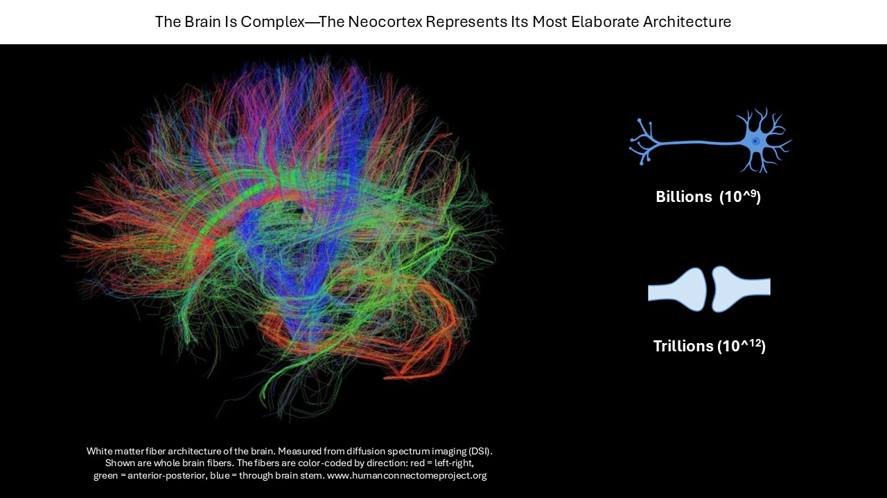
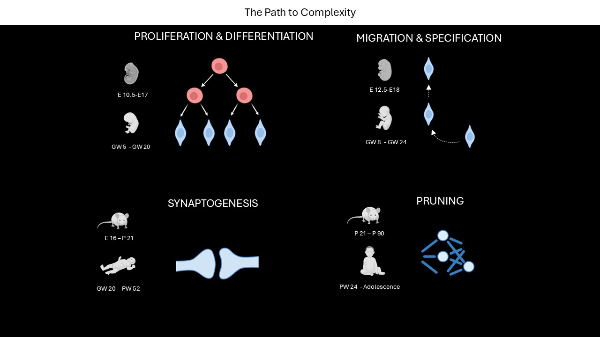
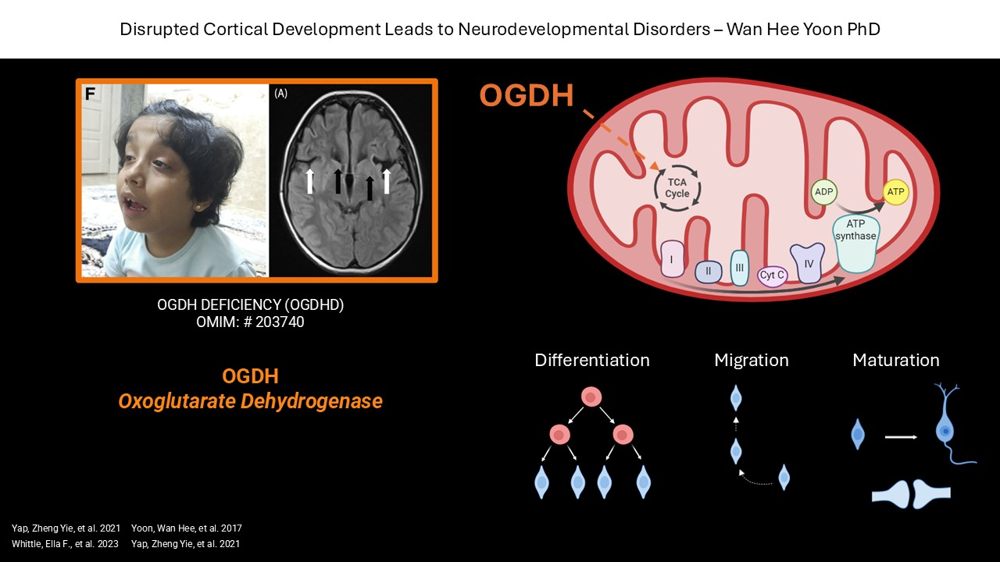
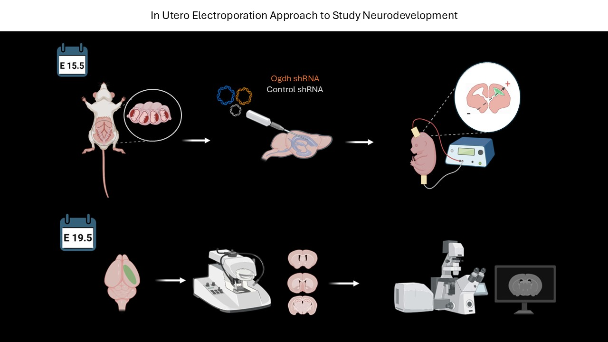
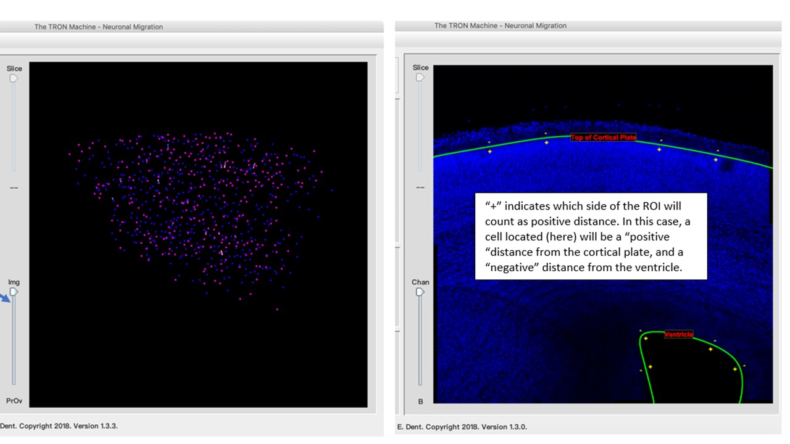
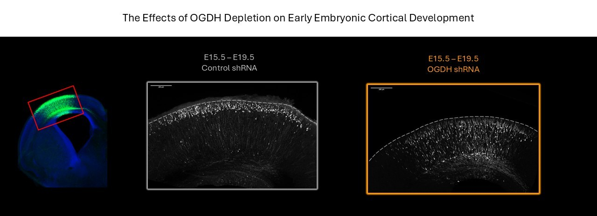

# Neuronal Migration Analysis in Developing Mouse Cortex - HOW TO TAME THE CHAOS

## Introduction

Our brains are extremely complex, billions of cells form trillions connections.

<br>

{fig-align="center" width="100%"}

<br>

What distinguishes us from other species is the complexity of the neocortex. That complexity is build by multiple
tightly precised stages of development consisting of proliferation and differentiation, **migration**, synaptogenesis
and pruning. These stages are highly **energy demanding** and require a **metabolic transition from glycolisys** in stem
cells **to** oxidativephosphorylation **(OXPHOS) in neurons.**

<br>

{fig-align="center" width="100%"}

<br>

What are the consequences of cortical development errors?<br> Those errors may result in neurodevelopmental disorders.
Pathogenic variants in OGDH, rate limiting components of the tricarboxylic acid (TCA) cycle, have been identified in
children with severe neurological impairment. **The molecular mechanisms by which these mutations give rise to
neurodevelopmental disorders remain poorly understood.** *One possibility is that alteration in OGDH activity or
abundance may impact the metabolic switch from glycolisys to OXPHOS, which can result in the cell struggling to
energetically support neurodevelopmental processes like neuronal migration.*

<br>

{fig-align="center" width="100%"}

<br>

**We decided to take a closer look at neuronal migration in OGDH deficiency model**. We performed **In Utero
Electroporation** surgeries to label newborn neurons destined to become building blocks of cortical layer 2/3 and
**follow them through development.**

<br>

{fig-align="center" width="100%"}

## Methods

To analyze neuronal migration I used *TronMachine*, an app developed by Erik Dent's lab
(https://dent.neuro.wisc.edu/tools-2/). <br>The app takes z-stacks of 10x confocal images, recognizes the cell body,
allows user to define start and end point of migration which usually is defined by **Lining of The Ventricle as start**
and **Top of The Cortical Plate as endpoint.**

{fig-align="center" width="100%"}

Here are some representative images I acquired.

{fig-align="center" width="100%"}

Here is the .xlsx file format Tron Machine spit out.

```{r}
library(readxl)

df <-read_excel("C:/Users/ciziok/katcizio.github.io/projects/neuronal_migration_analysis/data/Analysis R3/Tron Intermediate files/control/10x_1024_1umZ_KC63_M1_shc202_section_B_cropgreen ANALYSIS.xlsx")
head(df)

```

## Should we try to analyze it?

Each image gives a separate .xlsx file, so we have multiple files we need to work with. **Lets start with tidying that
mess.** Here is how the directory looks like:

```{r}

list.files ("C:/Users/ciziok/katcizio.github.io/projects/neuronal_migration_analysis/data/Analysis R3/Tron Intermediate files/control", recursive = FALSE)
```

```{r}

list.files ("C:/Users/ciziok/katcizio.github.io/projects/neuronal_migration_analysis/data/Analysis R3/Tron Intermediate files/knockdown", recursive = FALSE)
```

<br>

**Ugh... that is UGLY!**

My file names are not uniform and are **very confusing, too long for coding, not easily manageable** like this:
<br>**10x_1024_1umZ_KC72_M1_3169_section_A_crop ANALYSIS.xlsx** <br>

Sometimes there are spaces, sometimes there are underscores between words, **that needs to be unified.**

```{r}
# The File Names are not uniform and hard to refer to, lets fix that

library("tidyverse")                                   # Using tidyverse (includes stringr)

base_dir <- "C:/Users/ciziok/katcizio.github.io/projects/neuronal_migration_analysis/data/Analysis R3/Tron Intermediate files"
                                                      # Step 1: Tell R where the files are located

conditions <- c("control" = "CTL", "knockdown" = "KD") # Map folder names to condition labels

for (folder in names(conditions)) {                    # Loop through each folder name in 'conditions'
  
  folder_path <- file.path(base_dir, folder)           # Build full path: base_dir + folder name
  
  files <- list.files(folder_path,                     # Find all Excel files in the folder
                      pattern = "\\.xlsx$", 
                      full.names = TRUE)
  
  for (file in files) {                                # Process each file one by one
    
    old_name <- basename(file)                         # Get filename without folder path
    
    kc <- str_extract(old_name, "KC\\d+")              # Extract KC number (e.g., KC72)
    
    m <- str_extract(old_name, "M\\d+")                # Extract mouse number (e.g., M1)
    
    section <- str_extract(old_name, "section_([A-Z])")# Extract section (e.g., section_A)
    section_letter <- str_replace(section, "section_", "")  
                                                      # Remove 'section_' and keep only letter
    
    cond <- conditions[[folder]]                       # Get condition label (CTL or KD)
    
    new_name <- paste0(kc, "_", m, "_", cond, "_",     # Build new filename
                       section_letter, ".xlsx")
    
    output_folder <- paste0(folder, "_mut")            # Destination folder (control_mut, knockdown_mut)
    
    new_path <- file.path(base_dir, output_folder,     # Full path for renamed file
                          new_name)
    
    file.copy(file, new_path)                          # Copy + rename file into *_mut folder
  }
}

list.files(file.path(base_dir, "control"))          # Check original folder
list.files(file.path(base_dir, "control_mut"))      # Check renamed folder


```

<br>**YAAAYYYYYY, all the files have useful names now!** <br>

Now as we have nice easy file names, lets organize the cells of the files. We need to add a column that will help us
distinguish data once me merge those files together. To do so we will read files, extract their names, add new column
and name it with the file name we extracted.<br>

```{r}

# My files are .xlsx so I need to use libraries like library(readxl), library(writexl)

library(readxl)                                        # Read Excel files
library(writexl)                                       # Write Excel files

base_dir <- "C:/Users/ciziok/katcizio.github.io/projects/neuronal_migration_analysis/data/Analysis R3/Tron Intermediate files"
                                                       # Base directory where folders live

folders <- c("control_mut", "knockdown_mut")           # Tells R which folders to look into


for (folder in folders) {                              # Take each folder name and call it 'folder'
  
  folder_path <- file.path(base_dir, folder)           # Build full path to folder
  files <- list.files(folder_path,                     # Find all .xlsx files in folder
                      pattern = "\\.xlsx$", 
                      full.names = TRUE)
  
  for (file in files) {                                # Process each file one by one
    
    file_id <- tools::file_path_sans_ext(basename(file))
                                                       # Extract file name without extension
    
    df <- read_excel(file)                             # Read Excel file
    
    df$file_id <- file_id                              # Add new column with file_id
    
    write_xlsx(df, file)                               # Save updated file back to same location
  }
}


df <-read_excel("C:/Users/ciziok/katcizio.github.io/projects/neuronal_migration_analysis/data/Analysis R3/Tron Intermediate files/control_mut/KC63_M1_CTL_B.xlsx")
head(df)
```

Apparently one of the column in each of the excel files did not have a name, so R gave it made up name **...8**. Lets
fix that.

```{r}

library(readxl)                                        
library(writexl)                                       

base_dir <- "C:/Users/ciziok/katcizio.github.io/projects/neuronal_migration_analysis/data/Analysis R3/Tron Intermediate files"
                                                       # Base directory where folders live

folders <- c("control_mut", "knockdown_mut")           # Folders to process


for (folder in folders) {                              # Loop through each folder
  
  folder_path <- file.path(base_dir, folder)           # Build full path to folder
  
  files <- list.files(folder_path,                     # Find all .xlsx files
                      pattern = "\\.xlsx$", 
                      full.names = TRUE)
  
  for (file in files) {                                # Process each file
    
    df <- read_excel(file)                             # Read Excel file
    
    names(df)[names(df) == "...8"] <- "prc_dist_V_CP"  # Rename column ...8
    
    write_xlsx(df, file)                               # Save updated file back
  }
}

df <-read_excel("C:/Users/ciziok/katcizio.github.io/projects/neuronal_migration_analysis/data/Analysis R3/Tron Intermediate files/control_mut/KC63_M1_CTL_B.xlsx")
head(df)
```

<br>YAY it worked! <br>

*FIANLLY I GET TO COMBINE THE FILES TOGETHER* <br>

```{r}


library(dplyr)                                        # Data manipulation tools

folders <- c("control_mut", "knockdown_mut")          # Folders to process

all_data <- list()                                    # Empty list to store all data frames


for (folder in folders) {                             # First loop starts
  
  folder_path <- file.path(base_dir, folder)          # Build full path to folder
  
  files <- list.files(folder_path,                    # List all .xlsx files
                      pattern = "\\.xlsx$", 
                      full.names = TRUE)
  
  for (file in files) {                               # Second loop starts
    
    df <- read_excel(file)                            # Read Excel file
    
    df$condition <- folder                            # Add condition column (folder name)
    
    all_data[[length(all_data) + 1]] <- df            # Append df to list (each file = one element)
  }
}

migration_data <- bind_rows(all_data)                 # Combine all data frames into one tibble

write_xlsx(migration_data, "combined_migration_data.xlsx")
                                                      # Save combined dataset to Excel

glimpse(migration_data)


```

<br> Because I fixed the file names now I can use file_id column to pull out the information on the embryo batch, mouse
number, condition and section. I can extract all these to separate columns. <br>

```{r}


migration_data <- migration_data %>%
  mutate(
    KC = str_extract(file_id, "KC\\d+"),          # Extracts KC number (KC72)
    mouse = str_extract(file_id, "M\\d+"),        # Extracts mouse number (M1)
    section = str_extract(file_id, "[A-Z]$"),     # Extracts last letter (A/B/C)
    cond = ifelse(str_detect(file_id, "CTL"),     # Extracts condition
                  "control", "knockdown")
  )
                                                  # Saving to a separate excel, just because I can
write_xlsx(migration_data, "migration_data_with_metadata.xlsx")

glimpse(migration_data)
```

Nice! Now it will be easier to plot by condition, brain or embryo batch.

## CAN YOU BELIEVE IT IS ANALYSIS TIME?!

What is the mean distance cells traveled from ventricle to top of the cortical plate by condition?

```{r}


migration_data %>%
  group_by(cond) %>%
  summarise(mean_dist = mean(`prc_dist_V_CP`))
```

Lets plot density of cells by condition.

```{r}
library(ggplot2)
library(cowplot)


ggplot(migration_data, aes(x = prc_dist_V_CP, fill = cond)) +
  geom_density(alpha = 0.4) +
  labs(
    title = "Migration Density by Condition",
    x = "Percent Distance V → CP",
    y = "Density"
  ) +
 
  theme_cowplot()
```

Looks good! Seems like way more cells made it all the way to the top in control! How would a violin plot look like?

```{r}

migration_data <- read_excel("migration_data_with_metadata.xlsx")

ggplot(migration_data, aes(x = cond, y = prc_dist_V_CP, fill = cond)) +
  geom_violin(trim = FALSE, alpha = 0.6) +
  geom_boxplot(width = 0.15, outlier.shape = NA) +
  labs(
    title = "Migration Distribution (Violin)",
    x = "Condition",
    y = "Percent Distance V → CP"
  ) +
  theme_cowplot()

```

I like it way better! Lets look at cumulative distribution! It will show us proportion of cells reaching a given
distance.

```{r}
migration_data <- read_excel("migration_data_with_metadata.xlsx")

ggplot(migration_data, aes(x = prc_dist_V_CP, color = cond)) +
  stat_ecdf(size = 1.2) +
  labs(
    title = "Cumulative Migration Distribution",
    x = "Percent Distance V → CP",
    y = "Cumulative Fraction"
  ) +
  theme_cowplot()
```

Knockdown curve is left‑shifted which means fewer cells reach the CP! EXCITING! Lets visualize it better by binning!

```{r}
library(dplyr)
library(ggplot2)

migration_data <- read_excel("migration_data_with_metadata.xlsx")

migration_binned <- migration_data %>%                              # I am creating bins
                                                                    # I need to create new column called bin
                                                                    # Then "cut" my variables to converts them into discrete intervals        
  mutate(bin = cut(
    prc_dist_V_CP,
    breaks = seq(0, 100, by = 20),
    include.lowest = TRUE, 
    labels = paste0(seq(0, 80, by = 20), "-", seq(20, 100, by = 20))  # Make sure lowest value from first bin is included
  )) %>%
  group_by(cond, bin) %>%                                           # Grouping by condition and bin
  summarise(n = n()) %>%                                            # Count cells in each bin
  mutate(percent = n / sum(n) * 100)                                # Converting counts to percentages
 
  
ggplot(migration_binned, aes(x = bin, y = percent, fill = cond)) +  # Plotting the binned data
  geom_col(position = "dodge") +                                    # Dodge - bars are placed side by side
  labs(
    title = "Migration Binning (20% Intervals)",
    x = "Migration Bin (Percent V → CP)",
    y = "Percent of Cells"
  ) +
  theme_cowplot() +
  theme(
    axis.text.x = element_text(angle = 0, vjust = 0.2, hjust = 0.2), # keep horizontal
    axis.ticks.length = unit(2, "pt")
  )
```

## STATISTICS!

Lets visually check distribution.

```{r}
library(dplyr)

ggplot(migration_data, aes(x = prc_dist_V_CP)) +
  geom_histogram(bins = 30) +
  facet_wrap(~cond) +
  theme_cowplot()
  

```

This is definitely not normal distribution! Lets try some stats.

```{r}
wilcox.test(prc_dist_V_CP ~ cond, data = migration_data)


```

Seems like knockdown significantly reduces migration! Lets dig deeper! Does embryo batch accounts for any differences?

```{r}
mouse_medians <- migration_data %>%                     # Compute medians per mouse per condition
  group_by(KC, mouse, cond) %>%                         # Group by KC batch (embryo batch), mouse and condition 
  summarise(                                            # Calculate median migration distance
    median_prc = median(prc_dist_V_CP, na.rm = TRUE),
    n_cells    = sum(!is.na(prc_dist_V_CP)),            # Count how manay cells were measured for that mouse
    .groups    = "drop"                                 # Drop grouping so table is clear
)

mouse_medians
```

```{r}

library(lme4)       # mixed-effect modeling package
library(lmerTest)  # p-values

model_med <- lmer(
  median_prc ~ cond + (1 | KC) + (1 | mouse),          # is there natural difference between embryo batches or mice
  data = mouse_medians                                 # - Fixed effects: the estimated effect of knockdown and its p-value.
                                                       # - Random effects: how much KC and mouse contribute to variability.
                                                       # - Residuals: leftover variation not explained by the model.
)              

summary(model_med)          

```

The analysis tells us is that: <br>

**Intercept = 83.2**<br> This is the estimated median migration percentage for control mice, after accounting for KC and
mouse variability.<br>

**condknockdown = –9.51**<br> This is the key effect.Knockdown mice have a median migration distance \~9.5 percentage
points lower than control mice.<br>

**p = 0.0118** <br> This indicates the knockdown effect is statistically significant, even after accounting for KC batch
differences and mouse‑to‑mouse variability. <br>

**KC variance = 0** <br> This means KC batch does not contribute measurable variability in median migration. <br>

**mouse variance = 9.46 (SD ≈ 3.08)** <br> It means different mice have different baseline migration medians. <br>

**Residual variance = 7.14 (SD ≈ 2.67)** <br> This is the remaining variability not explained by condition or random
effects.<br>

## Key Findings

Migration distributions are strongly right‑skewed, with control neurons clustering near the cortical plate and knockdown
neurons showing a broader, left‑shifted pattern.<br>

Normality tests and visualizations confirm non‑normal distributions, making non‑parametric and mixed‑effects approaches
necessary.<br>

Wilcoxon rank‑sum testing shows a highly significant shift between conditions (p \< 2.2 × 10⁻¹⁶), indicating that
knockdown neurons occupy systematically lower migration positions.<br>

Per‑mouse median migration values reveal consistent biological replicates, with knockdown mice showing reduced migration
compared to controls. <br>

Mixed‑effects modeling confirms a robust knockdown effect, estimating a \~9.5 percentage‑point decrease in median
migration distance (p = 0.012) after accounting for mouse‑to‑mouse variability and KC batch. <br>

KC batch contributes no detectable variance, indicating stable experimental conditions across batches. <br>

THANK YOU!!!
